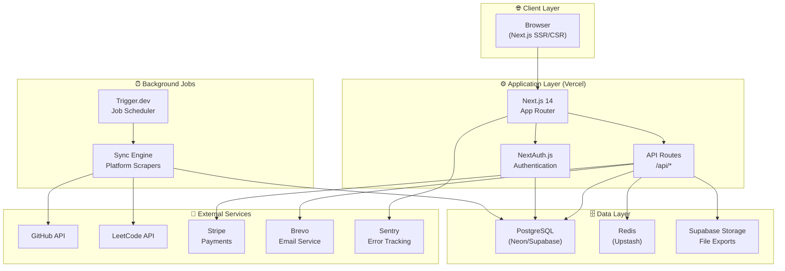

# 🏗️ System Overview

> **Last Updated**: 2026-03-15 | **Version**: 1.5.0
> **Status**: Published

## 📋 Table of Contents

- [Overview](#overview)
- [Architecture Diagram](#architecture-diagram)
- [Core Components](#core-components)
- [Data Flow](#data-flow)
- [External Services](#external-services)
- [Key Design Principles](#key-design-principles)

---

## 🎯 Overview

ProgressTracker is a **full-stack Next.js application** that helps developers track their programming journey across 50+ platforms. The system is built as a monorepo with server-side rendering, API routes, and background job processing.

**Core capabilities:**
- 🔄 **Multi-platform sync** - Automatically pull data from LeetCode, GitHub, HackerRank, etc.
- 📊 **Progress analytics** - Visualize streaks, goals, and achievements
- 🔔 **Smart notifications** - Email, push, and in-app notification channels
- 💳 **Subscription billing** - Stripe-powered tier management
- 🔐 **Secure auth** - NextAuth with OAuth, 2FA, and session management

---

## 📊 Architecture Diagram



---

## 🧩 Core Components

### 1. Frontend Layer

| Component | Technology | Purpose |
|-----------|-----------|---------|
| Pages | Next.js App Router | SSR/CSR page rendering |
| Components | React + TypeScript | Reusable UI elements |
| State | SWR + React Query | Data fetching and caching |
| Animations | Framer Motion | Smooth transitions |
| Charts | Recharts | Data visualization |
| Styling | Tailwind CSS | Utility-first CSS |

### 2. API Layer

| Component | Technology | Purpose |
|-----------|-----------|---------|
| API Routes | Next.js Route Handlers | RESTful endpoints |
| Validation | Zod | Input schema validation |
| Auth Middleware | NextAuth.js | Session validation |
| Rate Limiting | Upstash Redis | Throttle requests |

### 3. Database Layer

| Component | Technology | Purpose |
|-----------|-----------|---------|
| ORM | Prisma | Type-safe DB access |
| Database | PostgreSQL | Primary data store |
| Cache | Redis (Upstash) | Session + API caching |
| Search | PostgreSQL Full-Text | User/platform search |

### 4. Background Jobs

| Job | Schedule | Purpose |
|-----|----------|---------|
| Platform Sync | Every 6 hours | Auto-sync user platforms |
| Weekly Reports | Sunday 8AM | Email weekly summaries |
| Streak Check | Daily midnight | Check and update streaks |
| Goal Reminders | Daily 9AM | Send goal reminder emails |
| Cleanup | Weekly | Remove expired tokens |

---

## 🔄 Data Flow

### User Activity Tracking

```
User logs activity
    ↓
POST /api/tracker (validation → auth check)
    ↓
TrackerEntry saved to PostgreSQL
    ↓
Stats recalculated (streak, totals)
    ↓
Achievement check triggered
    ↓
Real-time dashboard update via SWR revalidation
```

### Platform Sync Flow

```
Trigger.dev job fires (schedule / manual)
    ↓
SyncService fetches user platforms
    ↓
For each platform:
    → Get OAuth credentials from DB (decrypted)
    → Call platform API / scraper
    → Parse response to TrackerEntry format
    ↓
Batch upsert to PostgreSQL
    ↓
SyncLog recorded
    ↓
User notified (in-app + email if enabled)
```

---

## 🔌 External Services

| Service | Purpose | Plan |
|---------|---------|------|
| **Vercel** | Hosting & deployment | Pro |
| **Neon/Supabase** | PostgreSQL database | Pro |
| **Upstash** | Redis cache | Pro |
| **Brevo** | Transactional email | Free/Pro |
| **Stripe** | Payment processing | Pay-per-use |
| **Trigger.dev** | Background jobs | Free/Pro |
| **Sentry** | Error tracking | Free |
| **Supabase Storage** | File storage | Free |

---

## 🎯 Key Design Principles

1. **Type Safety First** - TypeScript everywhere, Prisma types, Zod validation
2. **Edge-Ready** - Designed for Vercel Edge Functions where possible  
3. **Fail Gracefully** - All sync errors logged, never crash the user experience
4. **Security by Default** - All OAuth tokens encrypted, HTTPS enforced
5. **Performance** - Redis caching for hot paths, SWR for client-side freshness

---

## 📎 Related Docs

- [Tech Stack](02-tech-stack.md)
- [Folder Structure](03-folder-structure.md)
- [Sync Architecture](../sync/01-sync-architecture.md)
- [API Overview](../api/01-api-overview.md)
