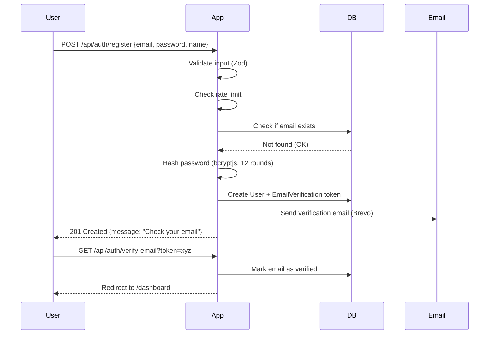
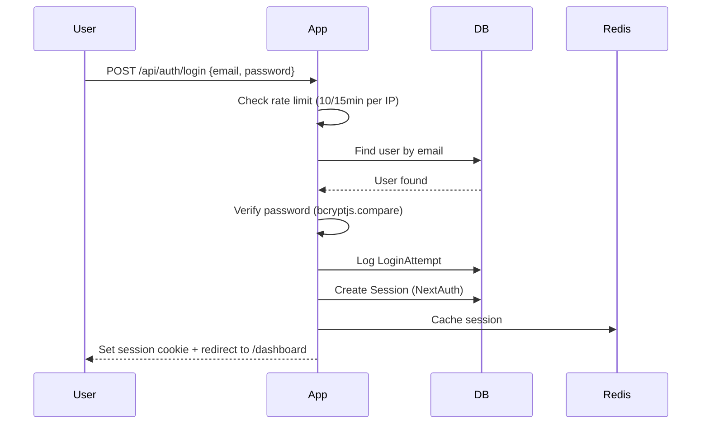
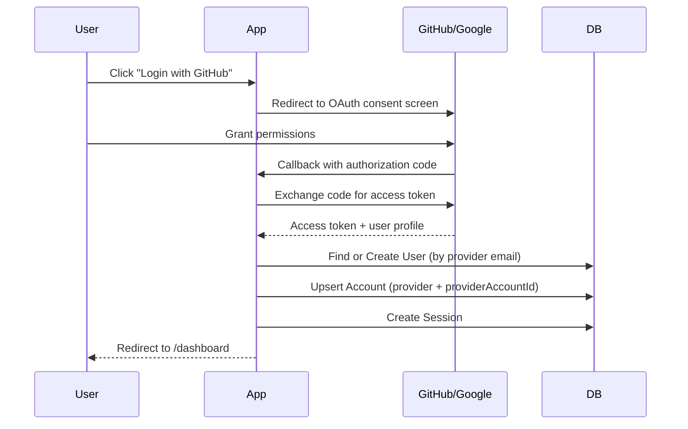

# 🔐 Authentication Flow

> **Last Updated**: 2026-03-15 | **Version**: 1.5.0

## 📋 Table of Contents
- [Auth Methods](#auth-methods)
- [Registration Flow](#registration-flow)
- [Login Flow](#login-flow)
- [OAuth Flow](#oauth-flow)
- [Password Reset Flow](#password-reset-flow)
- [Email Verification](#email-verification)

---

## 🔑 Auth Methods

ProgressTracker supports 3 authentication methods:

| Method | Description |
|--------|-------------|
| **Email + Password** | Traditional credential-based login |
| **GitHub OAuth** | One-click login via GitHub |
| **Google OAuth** | One-click login via Google |

All methods are powered by **NextAuth.js v4**.

---

## 📝 Registration Flow



---

## 🚪 Login Flow



### Failed Login

After 5 failed attempts:
- 15-minute lockout per email address
- Security alert notification sent to user
- LoginAttempt records created for audit

---

## 🔗 OAuth Flow (GitHub/Google)



---

## 🔒 Password Reset Flow

```
1. User clicks "Forgot Password"
2. POST /api/auth/forgot-password {email}
3. Server creates PasswordReset token (expires 1 hour)
4. Email sent with reset link
5. User clicks link → /reset-password?token=xyz
6. POST /api/auth/reset-password {token, newPassword}
7. Server validates token (not expired, not used)
8. Password hashed and saved
9. All existing sessions revoked
10. Redirect to login
```

---

## ✉️ Email Verification

**Required**: Users must verify email before accessing dashboard.

**Resend**: Users can request new verification email (rate limited: 3/hour).

**Expiry**: Verification tokens expire after 24 hours.

```typescript
// Verification token structure
{
  userId: string,
  email: string,
  token: string,  // random 64-char hex token
  expiresAt: Date, // now + 24 hours
  type: "verification"
}
```

---

## 🍪 Session Management

- **Type**: JWT-based sessions (configured in NextAuth)
- **Duration**: 30 days (configurable via `SESSION_MAX_AGE`)
- **Refresh**: Session refreshed on each page load (sliding window)
- **Storage**: Sessions stored in PostgreSQL via NextAuth adapter

---

## 📎 Related Docs

- [Session Management](02-session-management.md)
- [Two-Factor Auth](03-two-factor-auth.md)
- [API Overview](../api/01-api-overview.md)
