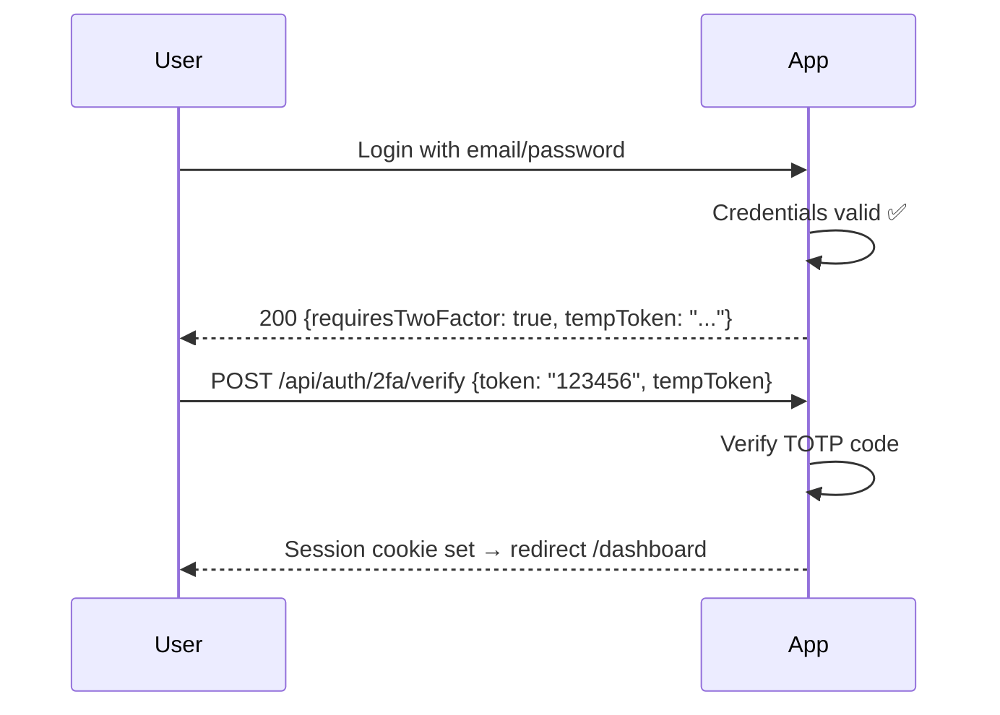

# 🔒 Two-Factor Authentication (2FA)

> **Last Updated**: 2026-03-15 | **Version**: 1.5.0

## 🎯 Overview

ProgressTracker supports **TOTP-based 2FA** (Time-based One-Time Password) using authenticator apps like Google Authenticator, Authy, or 1Password.

---

## ⚡ Setup Flow

```
1. User goes to Settings → Security → Enable 2FA
2. Server generates TOTP secret (base32 encoded)
3. QR code displayed (encoded: otpauth://totp/...)
4. User scans QR with authenticator app
5. User enters 6-digit code to confirm setup
6. Server verifies code, marks 2FA as enabled
7. Backup codes generated and shown ONCE
```

---

## 🔑 Login with 2FA



---

## 🛡️ Backup Codes

When 2FA is enabled, **10 backup codes** are generated:

- Each code is single-use
- Codes shown **only once** — user must save them
- Format: `XXXXX-XXXXX` (alphanumeric)
- Can regenerate codes (current codes invalidated)

```http
POST /api/auth/2fa/backup-codes/regenerate
Authorization: Bearer <token>
```

---

## 🔧 Technical Implementation

```typescript
// src/lib/totp.ts (custom TOTP implementation)

import { createHmac } from 'crypto';

export function generateSecret(): string {
  const bytes = crypto.getRandomValues(new Uint8Array(20));
  return base32Encode(bytes);
}

export function generateTOTP(secret: string, window: number = 0): string {
  const counter = Math.floor(Date.now() / 1000 / 30) + window;
  const secretBytes = base32Decode(secret);
  const counterBuffer = Buffer.alloc(8);
  counterBuffer.writeBigInt64BE(BigInt(counter));
  
  const hmac = createHmac('sha1', secretBytes).update(counterBuffer).digest();
  const offset = hmac[hmac.length - 1] & 0xf;
  const code = (
    ((hmac[offset] & 0x7f) << 24) |
    ((hmac[offset + 1] & 0xff) << 16) |
    ((hmac[offset + 2] & 0xff) << 8) |
    (hmac[offset + 3] & 0xff)
  ) % 1000000;
  
  return code.toString().padStart(6, '0');
}

export function verifyTOTP(token: string, secret: string): boolean {
  // Check current window + 1 window in each direction (clock drift tolerance)
  for (let w = -1; w <= 1; w++) {
    if (generateTOTP(secret, w) === token) return true;
  }
  return false;
}
```

---

## 📡 API Endpoints

| Method | Endpoint | Description |
|--------|----------|-------------|
| `POST` | `/api/auth/2fa/setup` | Get secret + QR URI |
| `POST` | `/api/auth/2fa/verify` | Verify TOTP during login |
| `POST` | `/api/auth/2fa/disable` | Disable 2FA (requires password) |
| `GET` | `/api/auth/2fa/backup-codes` | Get backup codes count (not values) |
| `POST` | `/api/auth/2fa/backup-codes/regenerate` | Regenerate backup codes |

---

## 📎 Related Docs

- [Authentication Flow](01-authentication-flow.md)
- [Session Management](02-session-management.md)
- [Security Overview](../security/01-security-overview.md)
