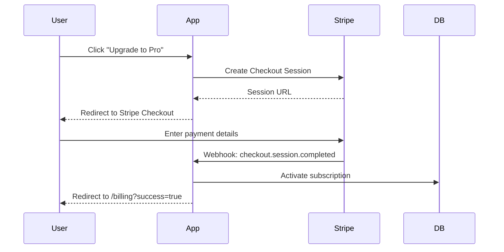

# 💳 Stripe Integration

> **Last Updated**: 2026-03-15 | **Version**: 1.5.0

## 🎯 Overview

ProgressTracker uses **Stripe** for subscription-based billing. This document covers the technical integration.

---

## 🔑 Environment Variables

```env
STRIPE_SECRET_KEY=sk_live_...
STRIPE_WEBHOOK_SECRET=whsec_...
STRIPE_STARTER_PRICE_ID=price_...
STRIPE_PRO_PRICE_ID=price_...
STRIPE_TEAM_PRICE_ID=price_...
STRIPE_STARTER_YEARLY_PRICE_ID=price_...
STRIPE_PRO_YEARLY_PRICE_ID=price_...
```

---

## 💳 Checkout Flow



---

## 🔄 Webhook Events Handled

| Event | Handler |
|-------|---------|
| `checkout.session.completed` | Activate subscription |
| `invoice.payment_succeeded` | Renew subscription |
| `invoice.payment_failed` | Mark as past_due, email user |
| `customer.subscription.deleted` | Downgrade to Free |
| `customer.subscription.updated` | Update tier in DB |
| `customer.subscription.trial_will_end` | Send trial ending email |

---

## ⚡ Billing Portal

Users can manage their subscription via Stripe's hosted billing portal:

```typescript
// Create billing portal session
const session = await stripe.billingPortal.sessions.create({
  customer: user.stripeCustomerId,
  return_url: `${process.env.NEXT_PUBLIC_APP_URL}/settings/billing`,
});
return redirect(session.url);
```

This allows users to:
- Update payment method
- Cancel subscription
- View invoice history
- Download receipts

---

## 🧪 Test Cards

| Card | Behavior |
|------|----------|
| `4242 4242 4242 4242` | Success |
| `4000 0000 0000 0002` | Declined |
| `4000 0025 0000 3155` | Requires 3D Secure |

---

## 📎 Related Docs

- [Subscription Tiers](02-subscription-tiers.md)
- [Payment Flows](03-payment-flows.md)
- [Webhook Handlers](../sync/03-webhook-handlers.md)
