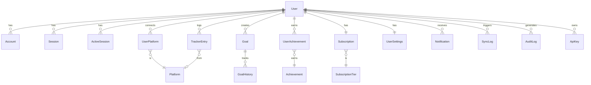

# 🗄️ Database Schema Overview

> **Last Updated**: 2026-03-15 | **Version**: 1.5.0

## 📋 Table of Contents
- [Overview](#overview)
- [Model Groups](#model-groups)
- [All Models Summary](#all-models-summary)
- [ER Diagram](#er-diagram)

---

## 🎯 Overview

ProgressTracker uses **PostgreSQL** via Prisma ORM. The schema has 40+ models organized into functional groups.

**Key stats:**
- 28+ enums
- 40+ models
- 100+ indexes
- All string IDs are CUIDs (`@default(cuid())`)

---

## 🧩 Model Groups

### 1. 👤 User & Authentication (11 models)

| Model | Purpose |
|-------|---------|
| `User` | Core user profile, stats, social links |
| `Account` | OAuth provider accounts (NextAuth) |
| `Session` | NextAuth sessions |
| `ActiveSession` | Detailed session tracking with device info |
| `RefreshToken` | JWT refresh tokens with family tracking |
| `PasswordReset` | Password reset tokens |
| `EmailVerification` | Email verification tokens |
| `EmailChangeRequest` | Email change flow (dual verification) |
| `TwoFactorAuth` | TOTP 2FA secrets |
| `BackupCode` | 2FA recovery codes |
| `LoginAttempt` | Login audit trail |

### 2. 🔌 Platforms (3 models)

| Model | Purpose |
|-------|---------|
| `Platform` | Platform catalog (LeetCode, GitHub, etc.) |
| `UserPlatform` | User's connected platform accounts |
| `CustomPlatform` | User-defined custom platforms |

### 3. 📊 Tracking (4 models)

| Model | Purpose |
|-------|---------|
| `TrackerEntry` | Individual activity log entries |
| `DailyStats` | Aggregated daily statistics per user |
| `StreakHistory` | Historical streak records |
| `RecentSearch` | User search history |

### 4. 🎯 Goals & Achievements (5 models)

| Model | Purpose |
|-------|---------|
| `Goal` | User goals with target metrics |
| `GoalReminder` | Scheduled goal reminders |
| `GoalHistory` | Goal status change audit |
| `Achievement` | Achievement definitions (50+ badges) |
| `UserAchievement` | User's earned achievements |

### 5. 🔔 Notifications (2 models)

| Model | Purpose |
|-------|---------|
| `Notification` | In-app + email notifications |
| `PushSubscription` | Web push VAPID subscriptions |

### 6. 💳 Billing (7 models)

| Model | Purpose |
|-------|---------|
| `Subscription` | User's active subscription |
| `Invoice` | Payment invoices |
| `PaymentMethod` | Saved payment methods |
| `PaymentEvent` | Stripe webhook events |
| `Coupon` | Discount codes |
| `CouponRedemption` | Coupon usage tracking |
| `SubscriptionTier` | Tier definitions and feature limits |

### 7. 📤 Export (2 models)

| Model | Purpose |
|-------|---------|
| `ExportJob` | On-demand export jobs |
| `ScheduledExport` | Recurring scheduled exports |

### 8. 🔄 Sync (1 model)

| Model | Purpose |
|-------|---------|
| `SyncLog` | Platform sync history and errors |

### 9. ⚙️ Settings (2 models)

| Model | Purpose |
|-------|---------|
| `UserSettings` | User preferences (theme, timezone, etc.) |
| `NotificationPreferences` | Per-channel notification settings |

### 10. 🔑 API & Security (3 models)

| Model | Purpose |
|-------|---------|
| `ApiKey` | API authentication keys |
| `AuditLog` | Security audit trail |
| `Webhook` | User-defined webhook endpoints |

### 11. 🎁 Referrals (2 models)

| Model | Purpose |
|-------|---------|
| `ReferralProgram` | Referral campaign definitions |
| `ReferralReward` | Earned referral rewards |

### 12. 📊 Analytics & Reports (2 models)

| Model | Purpose |
|-------|---------|
| `Report` | Generated progress reports |
| `EmailLog` | Email delivery tracking |

### 13. 🔗 Social & Content (5 models)

| Model | Purpose |
|-------|---------|
| `ShareLink` | Public profile share links |
| `ShareViewLog` | Share link analytics |
| `Feedback` | User product feedback |
| `BlogComment` | Blog post comments |
| `BlogPostLike` | Blog post reactions |

---

## 📊 ER Diagram

---

## 📎 Related Docs

- [Schema File](../../prisma/schema.prisma)
- [Relationships](02-relationships.md)
- [Enums Reference](03-enums-reference.md)
- [Indexes](04-indexes-optimization.md)
- [Migrations Guide](05-migrations-guide.md)
