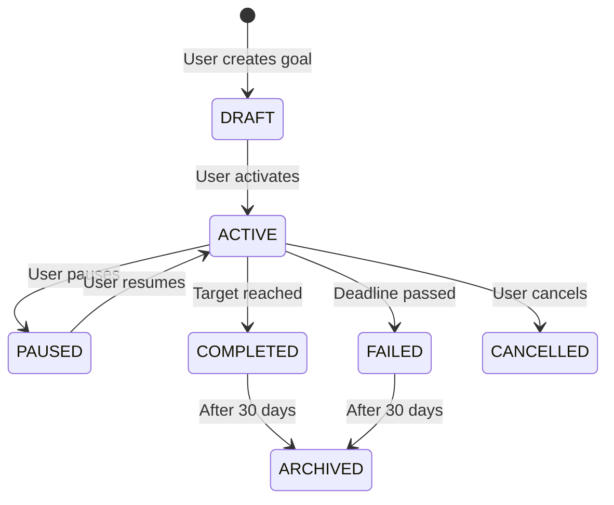

# 🎯 Goals System

> **Last Updated**: 2026-03-15 | **Version**: 1.5.0

## 🎯 Overview

The Goals system allows users to set measurable targets and track progress toward them.

---

## 🔢 Goal Types

| Type | Description | Example |
|------|-------------|---------|
| `DAILY` | Reset every day | Solve 2 problems today |
| `WEEKLY` | Reset every Monday | Solve 15 problems this week |
| `MONTHLY` | Reset on the 1st | 60 commits this month |
| `QUARTERLY` | Reset every 3 months | 500 problems this quarter |
| `YEARLY` | Reset Jan 1 | 1000 problems this year |
| `STREAK` | Maintain N consecutive days | Code for 30 days straight |
| `MILESTONE` | One-time target | Complete 100 LeetCode problems |
| `CUSTOM` | Custom date range | Custom project goals |

---

## 📊 Goal Metrics

| Metric | Description | Tracked From |
|--------|-------------|-------------|
| `PROBLEMS_SOLVED` | LeetCode/Codeforces problems | TrackerEntry |
| `COMMITS` | GitHub commits | TrackerEntry |
| `PULL_REQUESTS` | GitHub PRs merged | TrackerEntry |
| `PROJECTS_COMPLETED` | Projects finished | TrackerEntry |
| `COURSES_COMPLETED` | Online courses | TrackerEntry |
| `CERTIFICATIONS` | Certs earned | TrackerEntry |
| `APPLICATIONS_SUBMITTED` | Job applications | TrackerEntry |
| `CONTESTS_PARTICIPATED` | Coding contests | TrackerEntry |
| `TIME_SPENT` | Hours tracked | TrackerEntry.timeSpentMinutes |
| `STREAK_DAYS` | Consecutive active days | User.currentStreak |
| `CUSTOM` | User-defined metric | Manual |

---

## 🔄 Goal Lifecycle



---

## ⚙️ Goal Progress Calculation

Progress is calculated when:
1. User adds a TrackerEntry
2. Platform sync completes
3. Manual progress update

```typescript
// services/goalService.ts
async function updateGoalProgress(userId: string) {
  const activeGoals = await prisma.goal.findMany({
    where: { userId, status: 'ACTIVE' },
  });

  for (const goal of activeGoals) {
    const currentValue = await calculateMetric(goal.metric, userId, goal);
    const progress = (currentValue / goal.targetValue) * 100;
    
    await prisma.goal.update({
      where: { id: goal.id },
      data: { currentValue, progress: Math.min(progress, 100) },
    });

    if (currentValue >= goal.targetValue) {
      await completeGoal(goal.id);
      await triggerAchievementCheck(userId);
    }
  }
}
```

---

## 📅 Goal Reminders

Scheduled via **Trigger.dev** daily job at 9AM user timezone:

```typescript
// trigger/reminderJob.ts
.trigger('goal-reminders', async () => {
  const goalsAtRisk = await getGoalsAtRisk(); // due today with < 50% progress
  for (const goal of goalsAtRisk) {
    await sendGoalReminderEmail(goal);
    await createInAppNotification(goal.userId, 'GOAL_REMINDER', goal);
  }
})
```

---

## 📎 Related Docs

- [Core Features](01-core-features-overview.md)
- [Streak System](03-streak-system.md)
- [Notifications](05-notifications.md)
