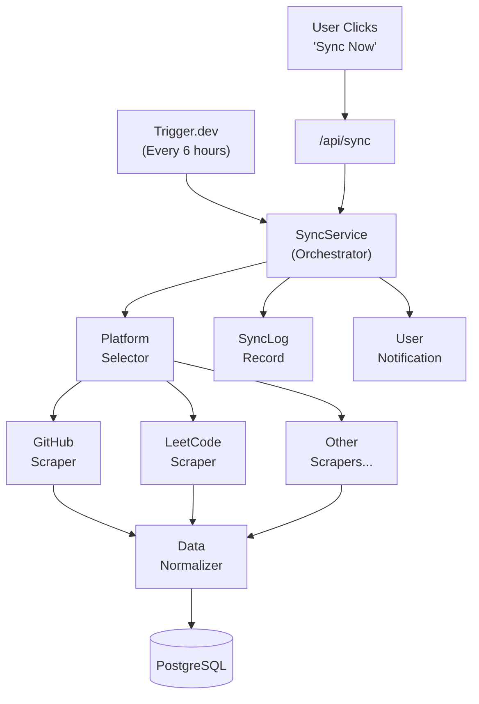

# 🔄 Sync Architecture

> **Last Updated**: 2026-03-15 | **Version**: 1.5.0

## 🎯 Overview

The Sync Engine automatically fetches data from connected coding platforms and converts it into `TrackerEntry` records in the database.

---

## 🏗️ Architecture



---

## ⚙️ Sync Process

```typescript
// Simplified sync orchestration
async function syncUserPlatforms(userId: string) {
  const platforms = await prisma.userPlatform.findMany({
    where: { userId, isConnected: true },
    include: { platform: true }
  });

  const results = await Promise.allSettled(
    platforms.map(up => syncPlatform(userId, up))
  );

  // Log results
  const syncLog = await prisma.syncLog.create({
    data: {
      userId,
      platformsAttempted: platforms.length,
      platformsSucceeded: results.filter(r => r.status === 'fulfilled').length,
      status: /* PARTIAL or SUCCESS or FAILED */,
    }
  });

  // Recalculate stats after sync
  await updateUserStats(userId);
  await updateStreak(userId);
  await checkAchievements(userId);
  
  // Notify user
  await createNotification(userId, 'SYNC_COMPLETE', { syncLogId: syncLog.id });
}
```

---

## 🔌 Platform Authentication Methods

| Method | Platforms | How |
|--------|-----------|-----|
| **OAuth** | GitHub, Google | OAuth tokens stored encrypted |
| **API Key** | HackerRank, CodeSignal | User provides key |
| **Scraping** | LeetCode, Codeforces | Public profile scraping |
| **Manual** | Custom platforms | User enters data manually |

---

## 💾 Data Normalization

Each scraper returns data in a standard format:

```typescript
interface ScrapeResult {
  problemsSolved: number;
  contestRating?: number;
  commits?: number;
  pullRequests?: number;
  timeSpentMinutes?: number;
  date: Date;
  metadata?: Record<string, unknown>;
}
```

This is then converted to `TrackerEntry` records.

---

## ⏱️ Sync Scheduling

| Trigger | Frequency | Who |
|---------|-----------|-----|
| Auto sync (Trigger.dev) | Every 6 hours | All users |
| Manual sync | Anytime | User-triggered |
| Post-login sync | On login | Active users |

**Rate limit**: Manual sync limited to once per 5 minutes per platform.

---

## 🔒 Credential Storage

OAuth tokens are **encrypted at rest** using AES-256:

```typescript
// Before storing in DB
const encrypted = encrypt(accessToken, process.env.ENCRYPTION_KEY);

// Before using in scraper
const decrypted = decrypt(encryptedToken, process.env.ENCRYPTION_KEY);
```

---

## 📎 Related Docs

- [Platform Scrapers](02-platform-scrapers.md)
- [Webhook Handlers](03-webhook-handlers.md)
- [Sync Troubleshooting](04-sync-troubleshooting.md)
